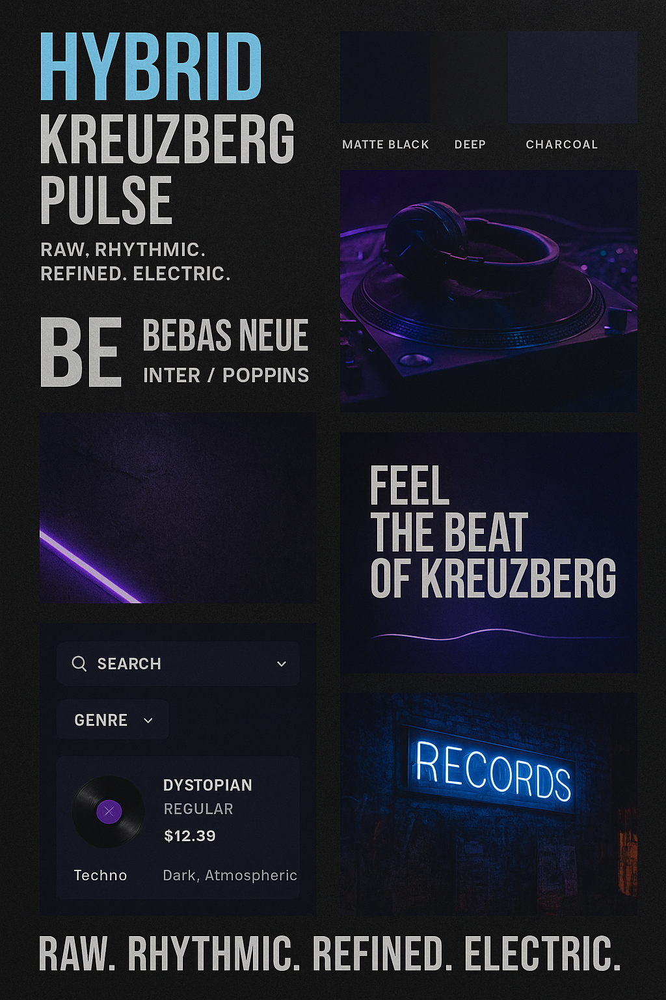

<!-- Banner -->
<p align="center">
  
</p>

<h1 align="center">🎧 Kreuzberg Records</h1>

<p align="center">
  <em>Raw. Rhythmic. Refined. Electric.</em><br>
  A concept record store web app inspired by Berlin’s underground sound and design culture.
</p>

<p align="center">
  <a href="https://kreuzberg-booking.netlify.app/"></a>
  <a href="https://github.com/phogatsahil98"></a>
  
</p>

---

## About the Project

Kreuzberg Records is a **dark-themed concept web application** blending Berlin’s *electronic underground aesthetic*  
with modern web experience.  
It’s not just a record store — it’s a **digital vibe** of a city that never stopped dancing.  

> “From vinyl shelves to virtual decks — we built a space where rhythm lives on.”

---

## Features Overview

| Category | Description |
|-----------|-------------|
| 🛒 **Record Store** | Browse, filter, and preview vinyl records with audio playback. |
| 🎚️ **Top 5 Sold Tapes** | Includes mini audio player with progress control and visualizer. |
| 🎟️ **Event System** | Upcoming DJ nights with artist, date, time & booking modal. |
| 🧾 **Booking Form** | Netlify-integrated + localStorage fallback for offline confirmation. |
| 🌍 **Real-time Berlin Clock** | Displays current time in Berlin automatically. |
| 🌀 **Scroll Animations** | IntersectionObserver-based reveal effects on scroll. |
| 🎨 **Dark Berlin Aesthetic** | Minimal design with bold red and white accents. |

---

## Folder Structure

```bash
kreuzberg-records/
│
├── index.html
│
├── /assets/
│   ├── images/        → backgrounds, posters, textures
│   ├── tapes/         → record cover art
│   ├── audio/         → vinyl previews (MP3)
│   └── icons/         → small UI icons
│
├── /data/
│   ├── records.json   → record inventory
│   └── events.json    → upcoming DJ events
│
├── /js/
│   └── script.js      → main app logic (audio, booking, animation)
│
├── /css/
│   ├── style.css      → dark aesthetic + layout
│   └── responsive.css → adaptive for mobile/tablet
│
└── README.md
```
---

## 🎧 Live Preview  

🚀 **Experience it here:**  
👉 [**Kreuzberg Records — Live Demo**](https://kreuzberg-booking.netlify.app/)  

> _Best viewed on desktop (Chrome / Edge). Mobile version available with adaptive design._

---

## 💡 Tech Stack  

| Technology | Purpose |
|-------------|----------|
| **HTML5 / CSS3** | UI and responsive layout |
| **JavaScript (ES6)** | Dynamic logic, DOM manipulation |
| **Web Audio API** | Audio preview player and visualizer |
| **Netlify Forms** | Booking submission system |
| **JSON Data Files** | Store product and event data |
| **IntersectionObserver API** | Scroll-based animations |

---

## 🎨 Design Philosophy

- **Color Palette:** `#0B0B0B` (charcoal), `#FF1E1E` (Berlin red), `#FFFFFF` (white)  
- **Typography:** `Poppins` for headers, `Roboto Mono` for accents  
- **Aesthetic:** Dark, minimal, underground  
- **Motion:** Smooth and subtle transitions; parallax depth used sparingly  

> Inspired by the concrete nights of Kreuzberg and the neon hum of techno clubs.  

---

## Future Enhancements  

- Brevo (Sendinblue) API integration for booking confirmations  
- Real-time event updates using Firebase  
- AI-powered vinyl recommendation system  
- Video-based background with ambient audio sync  
- Dynamic “Now Playing” vinyl animation  

---

## Setup Instructions  

1. **Clone the repository**
```bash
git clone https://github.com/<your-username>/kreuzberg-records.git
cd kreuzberg-records
```

2. **Run Locally**
```bash
npx live-server
```

**Final Note :** 
“I’m Making Changes — Join Me to See What’s Next.”</b>

<p align="center"> <b>© 2025 Kreuzberg Records | Designed & Developed by Sahil Phogat</b> </p> 


